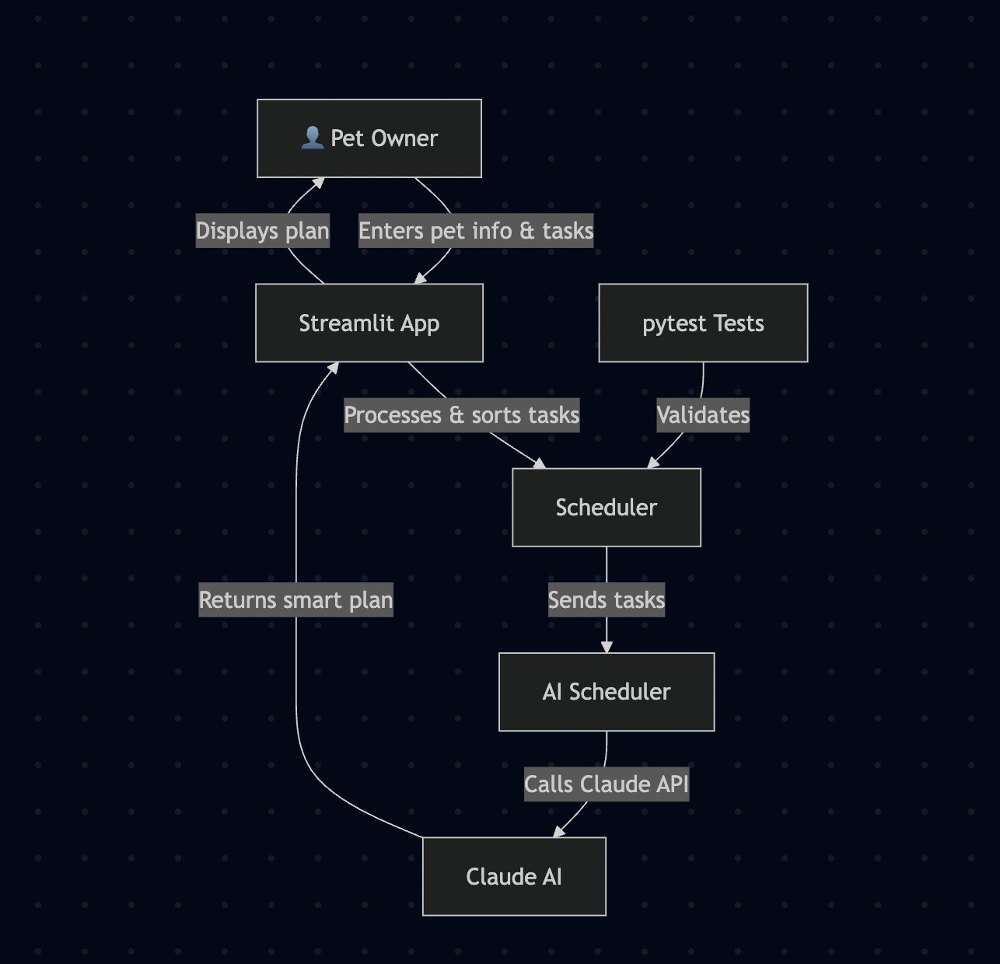

## Title and Summary
PawPal+ - Applied AI Pet Care System

The Applied AI Pawpal+ is a pet care app that helps busy owners stay on top of their pet's daily needs. It allows them to add tasks such as walks, medications, feedings, and then uses Claude AI to generate a smart daily schedule with explanations. This app is very beneficial because busy pet owners often struggle or forget to stay consistent with pet care. Having an AI generalized personal schedule saves so much time and helps owners provide the proper care that their pets require every day. 

This project is an extension of the original PawPal+ project from Module 3. The original app allowed pet owners to manually input tasks such as walks, medications, and feedings. It was able to sort tasks by time or priority, detect scheduling conflicts, and support recurring daily or weekly tasks. There was no AI involved at all. All of this was done by using rule-based logic. 

## Architecture Overview 

First, the user enters pet tasks and information into the Streamlit app. The Scheduler then sorts the tasks and detects any conflicts. Next, the AI Scheduler sends those tasks to the Claude API, which returns an intelligent personalized plan which gets displayed back to the user in the app. 

## Setup Instruction

1. Clone the repo - Download the project files to your computer
2. Create and activate a virtual environment 
3. Install dependencies - Installs Streamlit and Anthropic
4. Set the API key - Get the key from console.anthropic.com
5. Run the app - Start the Streamlit app and it opens in browser

## Sample Interactions

**Example 1**
- Pet: Mochi (dog)
- Tasks: Morning walk at 8am (priority 1), Feeding at 9am (priority 2), Medicine at 10am (priority 1)
- AI Output: 

**Example2**
- Pet: Mochi (dog)
- Tasks: Two walks scheduled at the same hour
- AI Output: 

## Design Decisions

I chose Claude AI because it has the capability to explain decisions in a simple manner. However, a tradeoff is that it requires an API key and credits to properly function. Streamlit was used for the UI because it's very easy to build an app on with it without needing a separate frontend framework. A tradeoff for this is that, it's a little less customizable than a full web application. Error handling and logging were added so that API failures are carefully tracked and the app never silently crashes, though it adds extra code to maintain. 

## Testing Summary 

## Reflection 
This project taught me a lot about AI usage. I learned that although AI can be of great support for projects like this, at the end of the day, it's up to me whether or not I should take its advice and suggestions. I also learned that AI works best only when I give it a clear and specific prompt, rather than a vague one. The biggest challenge I faced when creating this project was getting the anthropic module installed correctly and setting up the API key in the right terminal window every single time. AI helped me learn that errors are more than normal and it's just part of the process of creating something big in the end. It also taught me that certain tools need to be correctly set up in order to work, such as virtual environment and API key. 