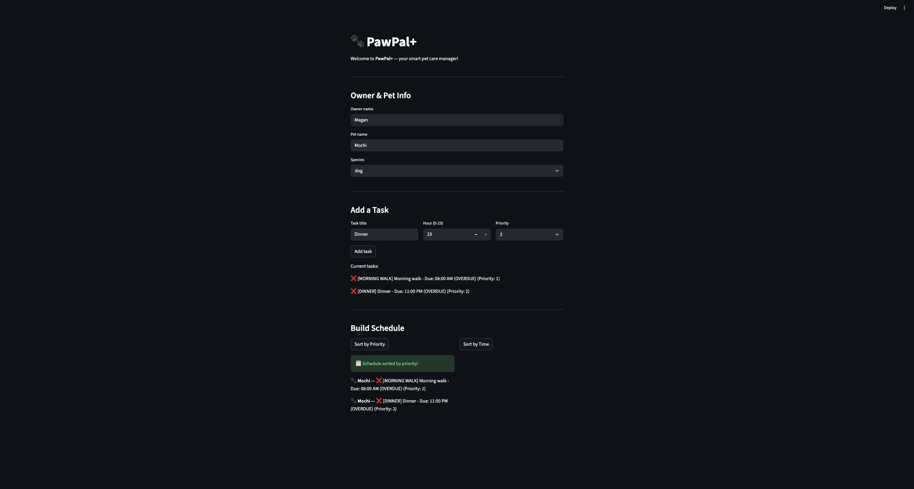

# PawPal+ (Module 2 Project)

You are building **PawPal+**, a Streamlit app that helps a pet owner plan care tasks for their pet.

## Scenario

A busy pet owner needs help staying consistent with pet care. They want an assistant that can:

- Track pet care tasks (walks, feeding, meds, enrichment, grooming, etc.)
- Consider constraints (time available, priority, owner preferences)
- Produce a daily plan and explain why it chose that plan

Your job is to design the system first (UML), then implement the logic in Python, then connect it to the Streamlit UI.

## What you will build

Your final app should:

- Let a user enter basic owner + pet info
- Let a user add/edit tasks (duration + priority at minimum)
- Generate a daily schedule/plan based on constraints and priorities
- Display the plan clearly (and ideally explain the reasoning)
- Include tests for the most important scheduling behaviors

## Getting started

### Setup

```bash
python -m venv .venv
source .venv/bin/activate  # Windows: .venv\Scripts\activate
pip install -r requirements.txt
```

### Suggested workflow

1. Read the scenario carefully and identify requirements and edge cases.
2. Draft a UML diagram (classes, attributes, methods, relationships).
3. Convert UML into Python class stubs (no logic yet).
4. Implement scheduling logic in small increments.
5. Add tests to verify key behaviors.
6. Connect your logic to the Streamlit UI in `app.py`.
7. Refine UML so it matches what you actually built.

## Features 
1. Note down pets and owners
2. Schedule any tasks for pet such as feedings, medications, and walks
3. Sort tasks by priority or time
4. Recurring daily/weekly tasks
5. Filter tasks by pet or completion status
6. Conflict detection warnings


## Smarter Scheduling 
PawPal+ new features:
1. Sort by time - tasks are ordered by due time, earliest first
2. Sort by priority - tasks are ordered by priority level (1 = highest)
3. Filter by pet - See tasks for a specific pet only
4. Filter by status - See only incomplete or complete tasks
5. Recurring tasks - Daily or weekly tasks automatically reschedule when marked as done
6. Conflict detection - Gives warning when two tasks are scheduled at the same hour for the same pet

## Testing PawPal+
To run:
-> python3 -m pytest

Tests cover:
1. Task completion status
2. Adding tasks to pets
3. Sorting tasks by time
4. Recurring task logic
5. Conflict detection

Confidence Level: 5 stars

## How to Run
Run the Streamlit App: streamlit run app.py
Run the Demo Script: python3 main.py
Run the Tests: python3 -m pytest


## Demo
<a href="/pawpal_screenshot.png" target="_blank"></a>
